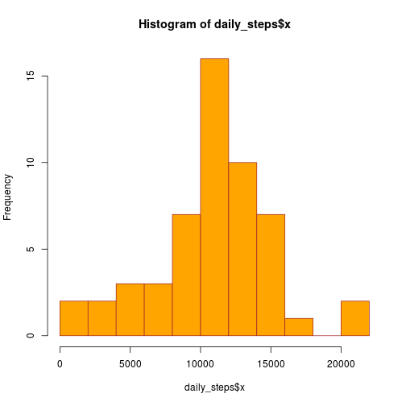
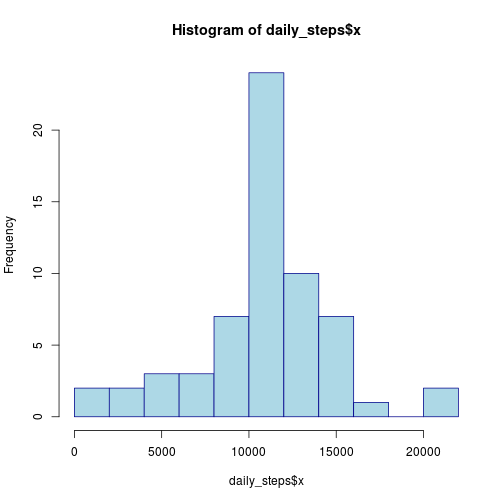
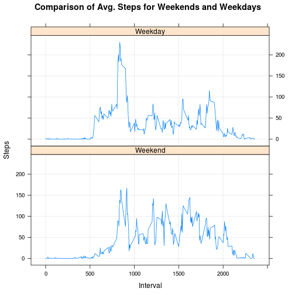

This markdown file contains the details of the work done to complete assignment 1 of the Reproducible Research course. The assignment requires us to perform some basic analysis on  real-time  measurements from devices such as fitbit, Nike fuelband etc.
This markdown file assumes that the data file is in the same directory.


```r
activity_data <- read.csv("activity.csv")
#Saving for posterity
act_data1 <- activity_data
act_data_no_na <- na.omit(activity_data)
str(activity_data)
```

```
## 'data.frame':	17568 obs. of  3 variables:
##  $ steps   : int  NA NA NA NA NA NA NA NA NA NA ...
##  $ date    : Factor w/ 61 levels "2012-10-01","2012-10-02",..: 1 1 1 1 1 1 1 1 1 1 ...
##  $ interval: int  0 5 10 15 20 25 30 35 40 45 ...
```

Now I calculate the daily steps

```r
daily_steps <-aggregate(act_data_no_na$steps, list(dates=act_data_no_na$date), sum)
```


```r
hist(daily_steps$x, breaks=8, col="orange", border="brown")
```

 

Five-number summary of data

```r
#I am not sure if this is less efficient than just calculating mean and median of the steps attribute
summary(daily_steps)
```

```
##         dates          x        
##  2012-10-02: 1   Min.   :   41  
##  2012-10-03: 1   1st Qu.: 8841  
##  2012-10-04: 1   Median :10765  
##  2012-10-05: 1   Mean   :10766  
##  2012-10-06: 1   3rd Qu.:13294  
##  2012-10-07: 1   Max.   :21194  
##  (Other)   :47
```

Calculate 5 min average

```r
five_min_avg <- aggregate(act_data_no_na[,1],  by=list(act_data_no_na$interval), FUN=mean)
colnames(five_min_avg) <- c("Interval", "AvgSteps")
```


```r
plot(five_min_avg, type="l", xlab="interval", ylab="average steps", main="Avg. Number of steps per 5-min interval")
```

 

Which interval has the maximum average number of steps?

```r
five_min_avg[five_min_avg[,2]==max(five_min_avg$AvgSteps),][1]
```

```
##     Interval
## 104      835
```

Now I calculate the number of rows with NA in the data set

```r
sum(is.na(activity_data$steps))
```

```
## [1] 2304
```

Replace NAs with 5 minute average values 

```r
for(i in 1:nrow(act_data1)) {
  if(is.na(act_data1[i,"steps"])) act_data1[i,"steps"] <- (five_min_avg[five_min_avg["Interval"]==act_data1[i,"interval"], "AvgSteps"])
  }

str(act_data1)
```

```
## 'data.frame':	17568 obs. of  3 variables:
##  $ steps   : num  1.717 0.3396 0.1321 0.1509 0.0755 ...
##  $ date    : Factor w/ 61 levels "2012-10-01","2012-10-02",..: 1 1 1 1 1 1 1 1 1 1 ...
##  $ interval: int  0 5 10 15 20 25 30 35 40 45 ...
```


Recalculating with adjusted NA values

```r
daily_steps <-aggregate(act_data1$steps, list(dates=act_data1$date), sum)
#plot(daily_steps$dates, daily_steps$x, type="p")
#plot(daily_steps$x,  type="h", main="Histogram of daily steps", xlab="days since beginning", ylab="Number of Steps")
```


```r
hist(daily_steps$x, breaks=8, col="lightblue", border="darkblue")
```

 

```r
summary(daily_steps)
```

```
##         dates          x        
##  2012-10-01: 1   Min.   :   41  
##  2012-10-02: 1   1st Qu.: 9819  
##  2012-10-03: 1   Median :10766  
##  2012-10-04: 1   Mean   :10766  
##  2012-10-05: 1   3rd Qu.:12811  
##  2012-10-06: 1   Max.   :21194  
##  (Other)   :55
```

Now, attach a factor for time of week (weekend/weekday)

```r
act_data1$TimeOfWeek <- factor(weekdays(as.Date(act_data1$date)))
levels(act_data1$TimeOfWeek) <- list(Weekend = c("Sunday", "Saturday"), Weekday=c("Monday", "Tuesday", "Wednesday", "Thursday", "Friday"))

head(act_data1)
```

```
##     steps       date interval TimeOfWeek
## 1 1.71698 2012-10-01        0    Weekday
## 2 0.33962 2012-10-01        5    Weekday
## 3 0.13208 2012-10-01       10    Weekday
## 4 0.15094 2012-10-01       15    Weekday
## 5 0.07547 2012-10-01       20    Weekday
## 6 2.09434 2012-10-01       25    Weekday
```

Now calculate and plot avg steps for each 5-min interval for weekdays and weekends.

```r
five_min_avg1 <- aggregate(act_data1$steps,  by=list(act_data1$TimeOfWeek, act_data1$interval), FUN=mean)
colnames(five_min_avg1) <- c("ToW", "Interval", "Steps")
```

```r
library(lattice)
xyplot(Steps~Interval|ToW, data=five_min_avg1, type="l", layout=c(1,2), main="Comparison of Avg. Steps for Weekends and Weekdays", grid=TRUE)
```

 

